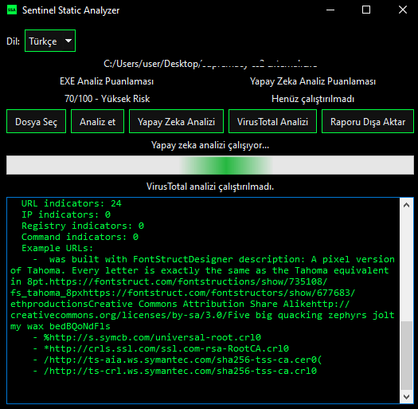

# Sentinel Static Analyzer (SSA) – 2026


<p align="center">
  
</p>

Sentinel Static Analyzer (SSA), Windows EXE dosyaları için **statik malware analizi** yapan, PyQt6 tabanlı GUI’si ve **Gemini 2.5 Flash** entegrasyonu sayesinde **yapay zeka destekli raporlama** sunan modern bir analiz aracıdır.

> 2026 sürümü: Gelişmiş string analizi, entropy temelli section incelemesi, YARA entegrasyonu ve olay müdahale (incident response) odaklı AI önerileri.

---

## 📚 İçindekiler

- [Özellikler](#-özellikler)
- [Mimari Genel Bakış](#-mimari-genel-bakış)
- [Kurulum](#-kurulum)
- [Konfigürasyon](#-konfigürasyon)
  - [Gemini API Anahtarı (.env)](#gemini-api-anahtarı-env)
  - [VirusTotal API Anahtarı (.env)](#virustotal-api-anahtarı-env)
- [Kullanım](#-kullanım)
  - [GUI (Önerilen)](#gui-önerilen)
  - [CLI](#cli)
- [Analiz Çıktıları](#-analiz-çıktıları)
  - [EXE Analiz Puanlaması](#exe-analiz-puanlaması)
  - [Yapay Zeka Analiz Puanlaması](#yapay-zeka-analiz-puanlaması)
- [Güvenlik ve Sınırlamalar](#-güvenlik-ve-sınırlamalar)
- [Yol Haritası](#-yol-haritası)
- [Katkıda Bulunma](#-katkıda-bulunma)
- [Geliştiren Hakkında](#-geliştiren-hakkında)

---

## ✨ Özellikler

- **Statik EXE Analizi**
  - PE header validasyonu ve temel format kontrolleri
  - Section bazlı analiz (boyut, entropy, RWX flag’leri)
  - Import analizi:
    - Privilege escalation API’leri
    - Anti-debug / anti-VM API’leri
    - Network, file, registry API kümeleri
  - Overlay tespiti (sonradan eklenmiş veri boyutu)

- **Gelişmiş String Analizi (2026)**
  - EXE içinden ASCII string çıkarımı
  - IOC odaklı filtreleme:
    - URL ve domain string’leri
    - IPv4 adresleri
    - Kayıt defteri / autostart yolları
    - Komut odaklı string’ler (`cmd.exe`, `powershell`, `schtasks`, `reg.exe`, `net user` vb.)
  - Rapor içinde:
    - Toplam string sayısı
    - URL / IP / registry / komut gösterge sayıları
    - Örnek IOC’lar (ilk birkaç değer)

- **YARA Entegrasyonu**
  - Yerel YARA kuralları ile tarama
  - Eşleşme sayısı ve kural isimlerinin rapora eklenmesi
  - AI tarafında bu eşleşmelere göre yorum üretebilme
  - YARA kural dosyaları `.yar`, `.yara` yanında `.txt` uzantılı dosyalardan da yüklenebilir

- **Risk Skorlaması (0–100)**
  - Privilege API’leri, anti-debug/VM davranışı, overlay, şüpheli section sayısı, YARA eşleşmeleri ve string tabanlı göstergelere göre skor
  - Seviye: `low`, `medium`, `high`, `critical`
  - GUI’de:
    - **EXE Analiz Puanlaması** bloğunda gösterim: `72/100 – Yüksek Risk`

- **VirusTotal Entegrasyonu (Free Public API)**
  - VirusTotal v3 REST API üzerinden dosya yükleyip analiz sonucunu özetler
  - GUI’de ayrı bir **VirusTotal Analizi** butonu ile tetiklenir
  - Alt kısımda:
    - `VirusTotal: malicious=… | suspicious=… | harmless=… | undetected=… | timeout=…`
  - Detay rapor içinde:
    - “VirusTotal summary:” başlığı
    - İlgili dosyanın VirusTotal GUI bağlantısı (permalink) satırı
  - Free public API limitleri:
    - 4 lookup/dk, 500 lookup/gün, 15.5K lookup/ay
    - Ticari ürün / iş akışlarında kullanılmamalıdır

- **Yapay Zeka Destekli Analiz (Gemini 2.5 Flash)**
  - Statik analiz JSON raporu Gemini’ye gönderilir (**EXE’nin kendisi asla gönderilmez**)
  - AI:
    - Risk skorunu (0–100) yeniden değerlendirir (`RISK_SCORE`, `RISK_LEVEL`)
    - Detaylı teknik özet ve risk analizi üretir
    - Raporun sonunda **manuel triage / olay müdahale komutları** önerir
  - GUI’de:
    - **AI Analysis Score** bloğunda gösterim: `80/100 – Critical Risk`
    - Metin raporunda, en altta “Manuel Kontrol ve Çözüm Önerileri” / “Manual Triage and Remediation Guidance” bölümü

- **Modern, Koyu Tema GUI**
  - PyQt6 ile tasarlanmış siyah tema arayüz
  - Türkçe / İngilizce dil seçimi (runtime)
  - Tek pencerede:
    - Dosya seçimi
    - EXE analiz skoru
    - Yapay zeka analiz skoru
    - Detaylı rapor
    - JSON export
    - “Yapay Zeka Analizi” butonu + progress bar + durum etiketi

---

## 🧩 Mimari Genel Bakış

Proje Python tabanlı, modüler bir mimariye sahiptir:

- `ssa/core/`
  - `engine.py` → Ana analiz pipeline’ı
  - `file_validator.py` → EXE/PE doğrulama
  - `pe_parser.py` → PE yükleme, hash ve overlay hesaplama
  - `scoring.py` → Risk skoru hesaplama
  - `yara_scanner.py` → YARA entegrasyonu
  - `report.py` → `AnalysisResult` modeli ve JSON export
- `ssa/core/features/`
  - `file_metadata.py` → Hash’ler, boyut, makine tipi, overlay
  - `imports.py` → Import analizi ve kategorizasyon
  - `sections.py` → Section ve entropy analizi
  - `anti_debug_vm.py` → Anti-debug / VM artefact analizi
  - `strings.py` → IOC odaklı string analizi (URL, IP, registry, komut)
- `ssa/gui/`
  - `app.py` → PyQt6 uygulama entry point’i, koyu tema
  - `main_window.py` → Ana GUI, puanlama blokları, rapor ve AI entegrasyonu
- `ssa/ai/`
  - `gemini_client.py` → Gemini 2.5 Flash HTTP istemcisi
- `ssa/integrations/`
  - `virustotal_client.py` → VirusTotal v3 REST API entegrasyonu (free public API)

---

## ⚙️ Kurulum

```bash
git clone https://github.com/<kendi-repo-adresin>/sentinel-static-analyzer.git
cd sentinel-static-analyzer

# Önerilen: sanal ortam
python -m venv venv
venv\Scripts\activate  # Windows

pip install -r requirements.txt
```

Temel bağımlılıklar:

- Python 3.11+
- `pyqt6`
- `yara-python`
- `pefile`
- `python-magic-bin` (Windows için)
- `requests` (Gemini ve VirusTotal entegrasyonları için)

---

## 🔐 Konfigürasyon

### Gemini API Anahtarı (.env)

Proje kökünde bir `.env` dosyası kullanılır:

```env
GEMINI_API_KEY=BURAYA_GERÇEK_GEMINI_API_KEY
```

Uygulama, sırasıyla:

1. Proje kökündeki `.env` dosyasından  
2. Son çare olarak ortam değişkeninden (`GEMINI_API_KEY`)

anahtarı okur.

> Güvenlik: API anahtarını asla repoya commit etme. `.env` dosyasını git ignore altında tut.

### VirusTotal API Anahtarı (.env)

Free public VirusTotal API anahtarını da `.env` dosyasına ekleyebilirsin:

```env
VT_API_KEY=BURAYA_VIRUSTOTAL_PUBLIC_API_KEY
```

- Free hesap limitleri (şu anda):
  - 4 lookup / dakika  
  - 500 lookup / gün  
  - 15.5K lookup / ay  
- Yalnızca kişisel ve ticari olmayan kullanım içindir; ticari ürüne doğrudan gömülmemelidir.

Uygulama, sırasıyla:

1. Proje kökündeki `.env` dosyasından `VT_API_KEY`  
2. Son çare olarak ortam değişkeninden (`VT_API_KEY`)  

anahtarı okur.

---

## 🖥️ Kullanım

### GUI (Önerilen)

```bash
cd sentinel-static-analyzer
python -m ssa --gui
```

Adımlar:

1. Sağ üstten **Türkçe** veya **English** dili seç.  
2. **Select File / Dosya Seç** butonu ile `.exe` dosyasını seç.  
3. **Analyze / Analiz et**:
   - Sol blokta EXE Analiz Puanlaması (`X/100 – seviye`)
   - Rapor alanında detaylı statik analiz çıktısı (hash, sections, import kategorileri, string analizi, YARA eşleşmeleri).
4. **AI Analysis / Yapay Zeka Analizi**:
   - Progress bar döner, durum etiketi “Yapay zeka analizi çalışıyor...” olur.
   - İş bitince:
     - Sağ blokta AI skoru (`Y/100 – seviye`)
     - Rapor alanında, mevcut raporun altında AI tarafından üretilen özet ve
       **manuel kontrol / çözüm önerileri** bölümü görünür.
5. **Export Report / Raporu Dışa Aktar**:
   - JSON formatında tam raporu dışa aktarır.
6. **VirusTotal Analizi**:
   - **VirusTotal Analizi / VirusTotal Scan** butonu ile tetiklenir.  
   - Free public API sınırları dahilinde dosya VirusTotal’a yüklenir (maks. 32 MB).  
   - Alt kısımda özet satırı görünür:
     - `VirusTotal: malicious=… | suspicious=… | harmless=… | undetected=… | timeout=…`  
   - Detay raporun en altında:
     - “VirusTotal summary:” bölümü ve dosyaya ait VirusTotal GUI bağlantısı (permalink) satırı yer alır.

### CLI

Headless kullanım için (ileride geliştirilebilir arayüz):

```bash
python -m ssa path\to\sample.exe
```

(İlerleyen sürümlerde CLI çıktıları ve argümanları genişletilebilir.)

---

## 📊 Analiz Çıktıları

### EXE Analiz Puanlaması

Statik motorun ürettiği skor:

- `0–20`: Düşük Risk  
- `21–40`: Orta Risk  
- `41–70`: Yüksek Risk  
- `71–100`: Kritik Risk  

Hesaplanırken dikkate alınanlar:

- Privilege escalation API sayısı  
- Anti-debug / anti-VM bulguları  
- Overlay varlığı ve boyutu  
- Şüpheli section sayısı (özellikle RWX)  
- YARA eşleşme sayısı  

GUI’de ayrı bir blokta, şu formatta gösterilir:

```text
72/100 - Yüksek Risk
```

### Yapay Zeka Analiz Puanlaması

Gemini 2.5 Flash:

- Statik rapora göre kendi `RISK_SCORE` (0–100) ve `RISK_LEVEL` yorumunu üretir.  
- İlk satırda `RISK_SCORE=.../100;RISK_LEVEL=...`  
- Sonrasında:
  - Ayrıntılı teknik analiz  
  - En altta:
    - Windows komut örnekleri  
    - Registry yolları  
    - Event log önerileri  
    - Şüpheli durumdaki manuel aksiyon adımları  

GUI’de ikinci blok:

```text
80/100 - Kritik Risk
```

---

## 🛡️ Güvenlik ve Sınırlamalar

- **Sadece statik analiz**: Dosya asla çalışma zamanında yürütülmez.  
- **Network tarafında**:
  - EXE’nin kendisi **hiçbir zaman** dışarı gönderilmez.  
  - Sadece JSON rapor içeriği Gemini API’ye gider.  
- **Yanlış pozitif / negatif**:
  - Heuristik tabanlı skor ve AI yorumları, yardımcı araçtır; tek başına nihai karar olarak kullanılmamalıdır.  
- **Üretim ortamı**:
  - Analizleri mümkünse sandbox / izole ortamda yapman önerilir.  
  - AI çıktıları, ön inceleme ve yönlendirme için kullanılmalıdır.  

---

## 🗺️ Yol Haritası

- [ ] Dijital imza (Authenticode) analizi ve sertifika zinciri doğrulama  
- [ ] TLS callback, export tablosu ve entry point anomalisi tespiti  
- [ ] String analizi sinyallerini davranış profili çıkarmada kullanma (downloader, stealer vb.)  
- [ ] YARA kural setlerini kategorize etme (ransomware, stealer, loader vb.)  
- [ ] GUI üzerinden YARA kural yönetimi
  - [ ] Tek bir `.yar` veya `.txt` kural seti dosyasını yükleyebilme  
  - [ ] Yerel YARA kural klasörünü arayüzden seçebilme / güncelleyebilme  
  - [ ] Yüklenen kural setlerinin listesini, kategori/tag bilgileriyle görüntüleme  
- [ ] Gelişmiş CLI arayüz (JSON, HTML çıktılar, profil seçimi)  
- [ ] Plugin/tabanlı analiz modülleri (özelleştirilebilir feature pipeline)  

---

## 🤝 Katkıda Bulunma

Katkılar memnuniyetle karşılanır.

1. Bu repoyu fork et  
2. Yeni bir branch aç: `feature/ozellik-adi`  
3. Değişikliklerini yap, mümkünse test ekle  
4. Açıklayıcı bir açıklama ile Pull Request aç  

---

## 👨‍💻 Geliştiren Hakkında

**Geliştirici:** Gökhan TAYLAN  

[](https://github.com/gkhantyln)
[](https://www.linkedin.com/in/gkhantyln/)
[](https://t.me/llcoder)
[](mailto:tylngkhn@gmail.com)

- **GitHub:** <https://github.com/gkhantyln>  
- **LinkedIn:** <https://www.linkedin.com/in/gkhantyln/>  
- **E‑posta:** <tylngkhn@gmail.com>  
- **Telegram:** <https://t.me/llcoder>  

> 2026 ve sonrası için hedef: Sentinel Static Analyzer’ı, gerçek incident response ekiplerinin günlük iş akışında kullanabileceği, genişletilebilir bir statik analiz platformuna dönüştürmek.

